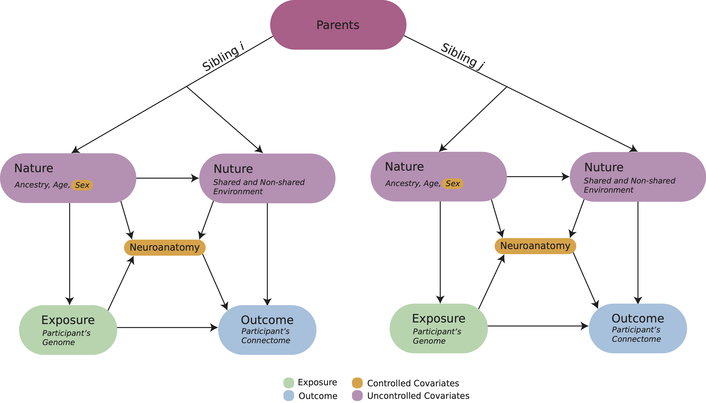
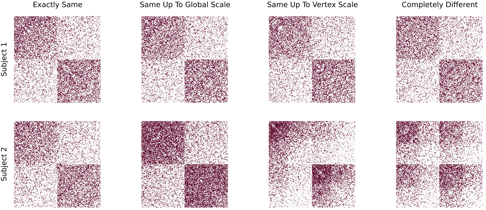
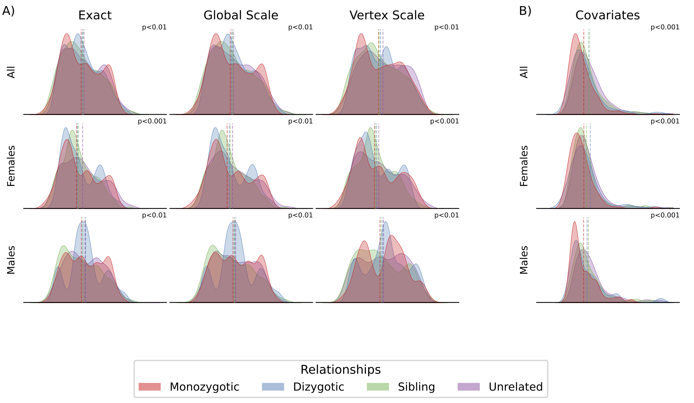
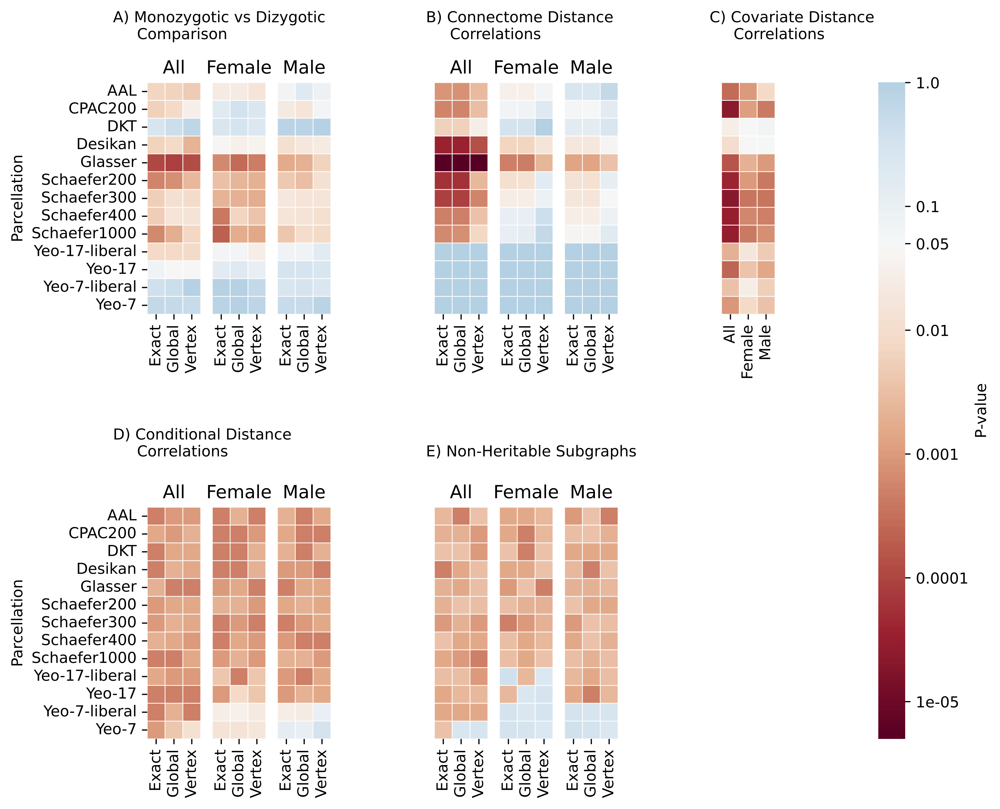

<!-- Start header -->

<!-- Image in the upper left -->

<!-- Title and author information -->

# Statistical Modeling of Structural Connectomes Reveal Heritability

## Jaewon Chung1\*, Eric Bridgeford1, Michael Powell1, Joshua T. Vogelstein1

##### 1 - Johns Hopkins University, $\ast$ - correspondence:  [_j1c@jhu.edu_](mailto:j1c@jhu.edu)  [_@j1c(Github)_](https://github.com/j1c)  [_@j1chung(Twitter)_](https://twitter.com/j1chung)

<!-- Image on the upper right -->

<!-- End header -->

<!-- Summary box title -->

 Summary 

<!-- Summary box using 5 columns-->

<!-- Box col1 -->

- Understanding how brain connectivity is influenced by genetics can improve our understanding of brain function and diseases.

- Brain connectivity is \textbf{more similar in identical twins} compared to those of fraternal twins, siblings, and unrelated in all three models.

- Existing methods ignore spatial arrangement of the brain and are not statistically justified.

- Random graph theory and statistical approach enable formulation and testing of different models of connectome heritability.

- Stochastic ordering of similarity, from most similar to least similar, in identical, fraternal twins, siblings and unrelated people.

<!-- End columns-box -->

<!-- End box -->

<!-- Start main 2 column split for poster -->

<!-- Start main column 1 -->

### Motivation

- Connectomes are rich sources of inspiration for architectures in artificial intelligence.
- Comparing connectomes could help elucidate which structural features are necessary for yielding the capabilities animal intelligences.
- Bilateral symmetry for connectomes is one such comparison; has been investigated, but not clearly defined as a network hypothesis.

### What are we going to do

<!-- Big question for this work -->

**Fig 1:** Overview of the framework for measuring heritability of connectomes.

## Do changes in genome cause changes in connectomes?

**Fig 2:** Overview of the framework for measuring heritability of connectomes.

 

**_Human Connectome Project 1200_**

|            | Monozygotic  |  Dizygotic  | Non-twin siblings |
| :--------: | :----------: | :---------: | :---------------: |
|     N      |     322      |     212     |        490        |
|    Sex     | 196 F, 126 M | 125 F, 87 M |   237 F, 253 M    |
| Age (mean) |  29.6 (3.3)  | 28.9 (3.4)  |    28.3 (3.9)     |

### Different Statistical Models of Connectomes

**Fig X:** Illustrative examples

- **Exact:** Are they the same?
- **Global scale:** Are they same after considering global differences?
- **Vertex scale:** Are they same after considering edge wise differences?

<!-- End main column 1 -->

<!-- Start main column 2 -->

### Examining Distribution

**Fig X:** Distributions examples

### Examining Different Parcellation

**Fig X:** All parcellations examples

### Limitations and extensions

- Other models to consider (e.g. random dot product graph [3])
- Other sensible neuron groupings for group connection test
- Matching nodes across networks leads to new models, likely more power

<!-- Code/Refs/Thanks/Funding - small section -->

###

#### Code

<!-- Logo for a package -->

<!-- Badges for a package -->

<!-- QR code to a package -->

<!-- Logo for a package -->

**hyppo**

<!-- Badges for a package -->

<!-- QR code to a package -->

 

#### Acknowledgements

<footer>
NeuroData lab for many ideas and feedback. Many at Microsoft Research for w/ graspologic.
</footer>

#### References

<!-- Need these breaks   between refs otherwise formatting breaks for some reason -->
<footer>
[1] Chung et al. "The complete connectome of an insect brain," In preparation (2022)
 
[2] Chung et al. "Statistical connectomics," Ann. Rev. Statistics and its Application (2021)
 
[3] Athreya et al. "Statistical inference on random dot product graphs: a survey," JMLR (2017)
</footer>

#### Funding

<footer>
J.C. supported by the BRAIN Initiative (1RF1MH123233). J.T.V. supported by NSF CAREER Award (1942963). Findings and conclusions expressed are  those of the authors and not necessarily those of the funders.
</footer>

<!-- End main column 2 -->

<!-- End main columns -->

